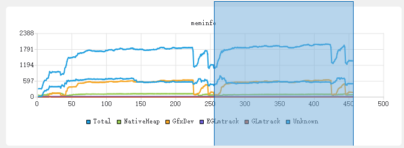
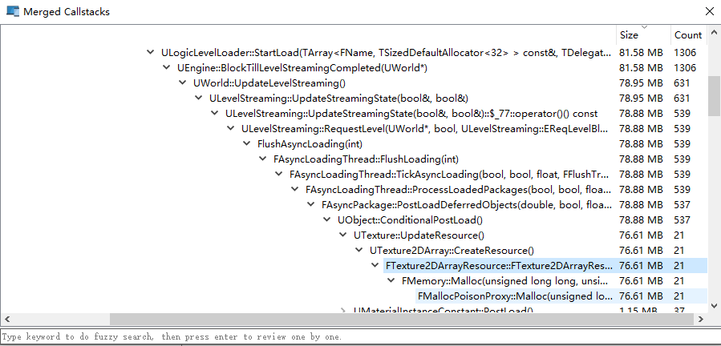

[TOC]

# Quick Start

You should close Android Studio / Unreal Engine Editor or any other process that uses adb bridge.

You may need to call **sudo spctl --master-disable** on recent version of Mac OS before use.

## Configuration

After downloading the latest version of LoliProfiler, you need to setup the location of Android SDK and Android NDK path if they are not found automatically: 

*Tips: Use Command+Shift+G to Goto any folder in Finder on Mac OS*


*Tips: Press ESC to quit configuration panel.*

### Parameters

Now you need to set correct parameter set for your Android application.

#### Compiler

First, choose the compiler your apk's so library use. For old project you should select gcc (Projects using NDK r16b or older). For newer project, UE4.25/4.26 for example, select llvm. 

*If you're mixing gcc and clang so libraries, you need to make your choice here. We don't support profiling both gcc and clang libraries.*

You may try this command to read the comment section of your so, it may tell you what compiler it's using:

```bash
# android-ndk-r16b\toolchains\arm-linux-androideabi-4.9\prebuilt\windows-x86_64\bin\arm-linux-androideabi-readelf.exe
readelf -p .comment path/to/your/library
# some library write compiler related info in comment section, but this may not be accurate. 
# String dump of section '.comment':
# [     1]  GCC: (GNU) 4.9.x 20150123 (prerelease)
```

#### Mode

Then you need to select memory allocation data collect pattern.

##### Strict Mode

This is the default mode you should use. It's for light or small projects. 

The mode will collect every malloc() call if the size of the allocation is greater than **Threshold**.

##### Loose Mode

This mode uses the same mechanism in perfetto's [heapprofd](https://perfetto.dev/docs/data-sources/native-heap-profiler). 

This mode will lower the allocation sampling rate to get better runtime performance. If strict mode is too slow to use, try this mode. 

The sampling rate is controlled by **Threshold** (Byte), recommended sample rate range is 1024(1KiB) to 1048576(1MiB).

##### No Stack Mode

This mode don't collect callstacks, it only saves allocation size. No stack mode can count library's total memory allocation with far less performance overhead. 

 #### Build

You can choose call stack unwind methods here.

##### Default

This is the one you should use if you did nothing with your apk file.

It uses Android's libunwind.so to unwind call stacks. This method is slow but works out of box.

You always want to start from here.

##### Instrumented

This is the optimized unwind mode. You've re-compiled your apk with compiler option **-finstrument-functions**, and added our custom unwind source code, then you should select this mode.

It's way faster than the default unwind mode. 10 times faster in single thread and 50 times faster in multi thread use case. Be aware this compiler will increase your code size and apk size.

##### Frame pointer

This is the fasted unwind method. If you're using latest NDK (r20, r21) and targeting arm64-v8a, you should re-compile your apk with option **-fno-omit-frame-pointer**. 

This method is even faster than instrument mode, it uses register to store function pointer information, so the unwind overhead is minimal. If you're using UE 4.25/4.26 or latest unity engine, you definitely want to try this mode. This is the only mode you should use if your game is heavy. 

#### Architecture

Choose the architecture of you application. Either armeabi-v7a or arm64-v8a, and we support legacy arch armeabi when you select gcc compiler.

#### Threshold

Threshold is configured together with **Mode** option. It means different in different mode.

#### Type & Libraries

Indicates the configured library list is used as white or black list.

You should start from using white list. For example, if you're using unity engine, add libunity to the list.

Add libUE4 if you're using UnrealEngine. 

**Note: Heavy game needs to re-compile. See [Game Engine](GAME_ENGINE.md).**

##### White List

Indicates profiler to hook listed libraries when profiling.

##### Black List

Indicates profiler to hook everyone else but listed libraries when profiling.

If you're using gcc compiler, i suggest you add these libraries to the blacklist, because they were compiled with clang:

```bash
libloli,libart,libc++,libc,libcutils,libart_base,libart_compiler
```


If you hook both clang & gcc libraries, your application will crash because [ABI](https://en.wikipedia.org/wiki/Application_binary_interface) compatibility issue. 

Do the same when you're using clang compiler.

**If collecting allocation data slows down your application too much, you can always try re-compile your application using technique explained in [Game Engine](GAME_ENGINE.md) section.**

## Select Target Application


Select the application you want to profile by pressing the button **...** on the left side of launch button.

## Launching Target Application

Press launch button to start the profiling process.

Then choose to launch or attach to running application.


If you need to attach to a running application. Use attach button. This mode will hang in stage "Injecting libloli.so xxx". Then you should minimize your app and recall it to trigger the inject process. We setup a break pointer in activity. onResume function, so you need to do this to when attach to running process.

Enable memory optimization if you're profiling heavy games. The Profiler will only save persistent allocation data.

Select No otherwise. Then the profiler will save all the allocation data it collected. You can select No by default.


When you press launch, the profiler does these under the hood:

```bash
# push libloli to target folder to load in app later.
adb push remote/libloli.so  /data/local/tmp
# mark the app as debug app and launch the app. so the app will wait for debugger to attach.
adb shell am set-debug-app -w com.company.app
adb shell monkey -p com.company.app -c android.intent.category.LAUNCHER 1
# get the jdwp id of the app and forward port to transfer data through tcp socket.
adb jdwp
adb forward tcp:8700 jdwp:xxxx
# finally, use jdwp protocol to inject some java code to load libloli.so
python jdwp-shellifier.py --target 127.0.0.1 --port 8700 --break-on android.app.Activity.onResume --loadlib libloli.so
```

## Collecting Data

When collected enough data, you can click the **Stop Capture** button to stop the process.


After capture stops, console will print the amount of records collected: 

```bash
# means you'v collected 189381 records related to malloc/realloc/.. method calls.
Captured 189381 records.
```

## Translating Data


Now you can switch to **StackTrace** tab. By selecting any of the record on the left side of the panel.

It's detailed call stacks will appear on the right. You can see that it's just a bunch of function addresses. 

That's because symbol translation process is CPU heavy, for performance reasons, we've moved this process to our Profiler. You need extra steps to see function names here.

Switch to **Dashboard** tab, and click the **Load Symbols** button, then select the correct symbol file of your so library. (If you're watching multiple libraries, you can load their symbols one by one.)


For unity games, the symbol of libil2cpp.so/libunity.so is located in these places:

```bash
Temp\StagingArea\libs\armeabi-v7a\
Editor\Data\PlaybackEngines\AndroidPlayer\Variations\il2cpp\Development\Symbols\armeabi-v7a\
```

You can copy selected record's detailed data to clipboard: 


## Viewing Collected Data

Profiler supports multiple data filtering modes, you can filter data by size/persistence/library.

The **Persistent** option will only print un-freed allocation records. Which is useful to seek leaks.

You can filter the list by time line either: 


On Mac OS with track pad, you press somewhere with one finger, then use another finger to drag to select a range of time. The selected area is then used as a time filter.

On Windows platforms, press shift and use mouse to drag your filter range.

Click **Tools->Show Merged Callstacks** will print combined view of all call stacks.

There's two type of view mode available:

Tree View Mode: Inspect data just like Instrument Allocations on Mac OS:


Tree Map Mode: Inspect the same data in tree map view: 


There's also a memory leak detect mode available:

**Tools->Show Leaks**

You can use Tree view or Tree map to inspect those possibly leaked call stacks.  


First run several rounds of your game.



Then select the area ranging from round start to round end.

The Profiler will diff persistent allocation records [0s-250s] with [0s-450s].

And printing out those possible leaked callstacks for you:



You can also view your application's proc/pid/smaps data:


And get some info about memory fragmentation:


## Saving Collected Data

Don't forget to save the collected data before quit the profiler.